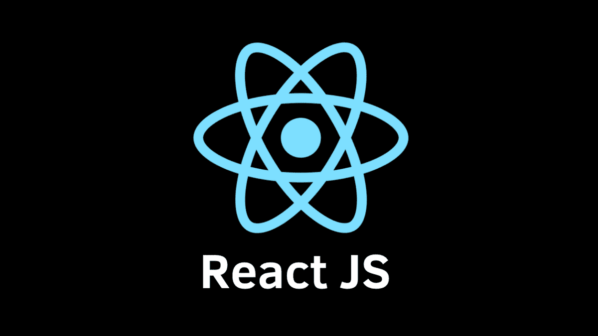

<h2 align="center">☁️ DreamCoding React Study</h2>
<div align="center">
  
</div>
<p align="center">[드림코딩] 리액트 개념정리 및 클론코딩 강의를 통한 리액트 스터디</p>

<br>

## INFO

[**Dream Coding : 리액트 개념정리 · 클론코딩 강의 보러가기** 👉](https://academy.dream-coding.com/courses/react)

<br>

**✨ Challenge**

> 이번 강의를 통한 챌린지 프로젝트

- to do list
- youtube clone coding
- shopping mall
- etc (mini projects)

<br>

**🎯 Goal**

> 이번 강의를 하면서, 강의가 끝난 후 나의 목표

- 리액트 개념을 완벽하게 이해하고 다양한 Public APIs를 활용해서 나만의 프로젝트를 만들기
- 강의가 끝나고 Firebase를 통해 백엔드를 구축해서 프로젝트 하나 만들기
- 나만의 온라인 쇼핑몰 혼자 처음부터 끝까지 만들어보기 OR 지그재그 쇼핑몰 클론코딩

<br>

**🔗 Resource**

> 공식 사이트 & 유용한 사이트

| 구분                     | 링크                                                   |
| ------------------------ | ------------------------------------------------------ |
| React 공식 문서          | https://ko.reactjs.org/docs/getting-started.html       |
| React 베타 문서          | https://react.dev/                                     |
| Create React App         | https://create-react-app.dev/                          |
| HTML to JSX Transform    | https://transform.tools/html-to-jsx                    |
| 사용한 Box Shadow 사이트 | https://cssgenerator.org/box-shadow-css-generator.html |

<br>

**🔥 Insall**

```bash
$ cd dream-react-cra
$ npm install
$ npm start
```

<br>
<br>

## Projects

[React CSS Library Project 보러가기 👉](https://github.com/mireyhgnay/react-css-library)

[To Do Project 보러가기 👉](https://github.com/mireyhgnay/toy-react-todolist)

[Youtube Project 보러가기 👉]()

[Shopping Mall Project 보러가기 👉]()

<br>
<br>

## My Study Note

### React의 주요 철학은 모든 UI의 업데이트는 상태 변경으로 부터 발생해야 한다.

[✏️ React : 라이브러리와 프레임워크 차이점](https://github.com/mireyhgnay/dream-react-study/blob/main/study-note/React%20:%20%EB%9D%BC%EC%9D%B4%EB%B8%8C%EB%9F%AC%EB%A6%AC%EC%99%80%20%ED%94%84%EB%A0%88%EC%9E%84%EC%9B%8C%ED%81%AC%20%EC%B0%A8%EC%9D%B4%EC%A0%90.md)

[✏️ React : 리액트 동작 원리](https://github.com/mireyhgnay/dream-react-study/blob/main/study-note/React%20:%20%EB%A6%AC%EC%95%A1%ED%8A%B8%20%EB%8F%99%EC%9E%91%20%EC%9B%90%EB%A6%AC.md)

[✏️ React : JSX 문법 정리](https://github.com/mireyhgnay/dream-react-study/blob/main/study-note/React%20:%20JSX%20%EB%AC%B8%EB%B2%95%20%EC%A0%95%EB%A6%AC.md)

[✏️ React : 이미지 넣는 방법 (이미지 경로)](https://github.com/mireyhgnay/dream-react-study/blob/main/study-note/React%20:%20%EC%9D%B4%EB%AF%B8%EC%A7%80%20%EB%84%A3%EB%8A%94%20%EB%B0%A9%EB%B2%95.md)

[✏️ React : React Router(리액트 라우터)와 CSR(Client Side Routing)](<https://github.com/mireyhgnay/dream-react-study/blob/main/study-note/React%20:%20React%20Router(%EB%A6%AC%EC%95%A1%ED%8A%B8%20%EB%9D%BC%EC%9A%B0%ED%84%B0)%EC%99%80%20CSR(Client%20Side%20Routing).md>)

[🛠️ React 개발 환경 설정 : Node 에 대한 간략한 설명](https://github.com/mireyhgnay/dream-react-study/blob/main/study-note/React%20%EA%B0%9C%EB%B0%9C%20%ED%99%98%EA%B2%BD%20%EC%84%A4%EC%A0%95%20:%20Node%20%EC%97%90%20%EB%8C%80%ED%95%9C%20%EA%B0%84%EB%9E%B5%ED%95%9C%20%EC%84%A4%EB%AA%85.md)

[🛠️ React 개발 환경 설정 : Create React App 프로젝트 만들기](https://github.com/mireyhgnay/dream-react-study/blob/main/study-note/React%20%EA%B0%9C%EB%B0%9C%20%ED%99%98%EA%B2%BD%20%EC%84%A4%EC%A0%95%20:%20Create%20React%20App%20%ED%94%84%EB%A1%9C%EC%A0%9D%ED%8A%B8%20%EB%A7%8C%EB%93%A4%EA%B8%B0.md)

[🛠️ React 개발 환경 설정 : 개발 툴 Babel, Webpack](https://github.com/mireyhgnay/dream-react-study/blob/main/study-note/React%20%EA%B0%9C%EB%B0%9C%20%ED%99%98%EA%B2%BD%20%EC%84%A4%EC%A0%95%20%20:%20%EA%B0%9C%EB%B0%9C%20%ED%88%B4%20Babel%2C%20Webpack.md)

[👩🏻‍💻 React : Props를 통해 컴포넌트 재사용성 높이기](https://github.com/mireyhgnay/dream-react-study/blob/main/study-note/React%20:%20Props%EB%A5%BC%20%ED%86%B5%ED%95%B4%20%EC%BB%B4%ED%8F%AC%EB%84%8C%ED%8A%B8%20%EC%9E%AC%EC%82%AC%EC%9A%A9%EC%84%B1%20%EB%86%92%EC%9D%B4%EA%B8%B0.md)

[👩🏻‍💻 React : Event 처리하기](https://github.com/mireyhgnay/dream-react-study/blob/main/study-note/React%20:%20Event%20%EC%B2%98%EB%A6%AC%ED%95%98%EA%B8%B0.md)

[👩🏻‍💻 React : useEffect 사용하여 데이터 한번만 호출하기](https://github.com/mireyhgnay/dream-react-study/blob/main/study-note/React%20:%20useEffect%20%EC%82%AC%EC%9A%A9%ED%95%98%EC%97%AC%20%EB%8D%B0%EC%9D%B4%ED%84%B0%20%ED%95%9C%EB%B2%88%EB%A7%8C%20%ED%98%B8%EC%B6%9C%ED%95%98%EA%B8%B0.md)

[👩🏻‍💻 React : 고유한 key 설정하기.md](https://github.com/mireyhgnay/dream-react-study/blob/main/study-note/React%20:%20%EA%B3%A0%EC%9C%A0%ED%95%9C%20key%20%EC%84%A4%EC%A0%95%ED%95%98%EA%B8%B0.md)

[👩🏻‍💻 React : 상태관리 라이브러리](https://github.com/mireyhgnay/dream-react-study/blob/main/study-note/React%20:%20%EC%83%81%ED%83%9C%EA%B4%80%EB%A6%AC%20%EB%9D%BC%EC%9D%B4%EB%B8%8C%EB%9F%AC%EB%A6%AC.md)

[👩🏻‍💻 React : Hook - useReducer](https://github.com/mireyhgnay/dream-react-study/blob/main/study-note/React%20:%20Hook%20-%20useReducer.md)

[👩🏻‍💻 React : useImmer 사용해보기](https://github.com/mireyhgnay/dream-react-study/blob/main/study-note/React%20:%20useImmer%20%EC%82%AC%EC%9A%A9%ED%95%B4%EB%B3%B4%EA%B8%B0.md)

[👩🏻‍💻 React : Form을 만들기 위해서는 상태를 설정해주어야한다](https://github.com/mireyhgnay/dream-react-study/blob/main/study-note/React%20:%20Form%EC%9D%84%20%EB%A7%8C%EB%93%A4%EA%B8%B0%20%EC%9C%84%ED%95%B4%EC%84%9C%EB%8A%94%20%EC%83%81%ED%83%9C%EB%A5%BC%20%EC%84%A4%EC%A0%95%ED%95%B4%EC%A3%BC%EC%96%B4%EC%95%BC%ED%95%9C%EB%8B%A4.md)

[👩🏻‍💻 React : Context API 와 다크모드](https://github.com/mireyhgnay/dream-react-study/blob/main/study-note/React%20:%20Context%20API%20%EC%99%80%20%EB%8B%A4%ED%81%AC%EB%AA%A8%EB%93%9C.md)

[🔥 React : Netlify로 배포하기](https://github.com/mireyhgnay/dream-react-study/blob/main/study-note/React%20:%20Netlify%EB%A1%9C%20%EB%B0%B0%ED%8F%AC%ED%95%98%EA%B8%B0.md)

**React Router & Query**

[📁 React : Router 사용하기]()
