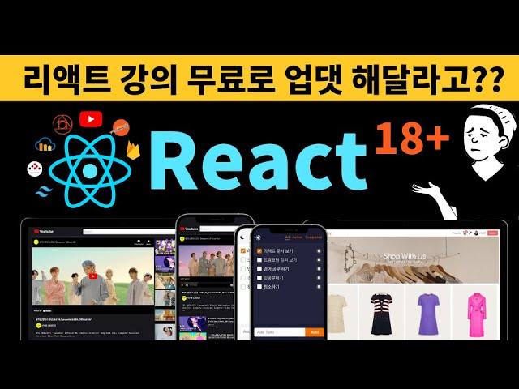

<h2 align="center">☁️ DreamCoding React Study</h2>

  

[드림코딩] 리액트 개념정리 및 클론코딩 강의를 통한 리액트 스터디

 

## INFO

[**Dream Coding : 리액트 개념정리 · 클론코딩 강의 보러가기** 👉](https://academy.dream-coding.com/courses/react)

[**Notion : 개인 노션 정리 보러가기** 👉](https://hyerimiya.notion.site/c11bd49955b84f828dd77a3516ca6ce7)

 

**✨ Challenge**

> 이번 강의를 통한 챌린지 프로젝트

- to do list
- youtube clone coding
- shopping mall
- etc (mini projects)

 

**🎯 Goal**

> 이번 강의를 하면서, 강의가 끝난 후 나의 목표

1. 리액트 개념을 완벽하게 이해하고 다양한 Public APIs를 활용해서 나만의 프로젝트를 만들기
2. 강의가 끝나고 Firebase를 통해 백엔드를 구축해서 프로젝트 하나 만들기
3. 나만의 온라인 쇼핑몰 혼자 처음부터 끝까지 만들어보기 OR 지그재그 쇼핑몰 클론코딩

 
 

## My Study Note

[📌 React : 라이브러리와 프레임워크 차이점](https://github.com/mireyhgnay/dream-react-study/blob/main/study-note/React%20:%20%EB%9D%BC%EC%9D%B4%EB%B8%8C%EB%9F%AC%EB%A6%AC%EC%99%80%20%ED%94%84%EB%A0%88%EC%9E%84%EC%9B%8C%ED%81%AC%20%EC%B0%A8%EC%9D%B4%EC%A0%90.md)  
[📌 React : 리액트 동작 원리](https://github.com/mireyhgnay/dream-react-study/blob/main/study-note/React%20:%20%EB%A6%AC%EC%95%A1%ED%8A%B8%20%EB%8F%99%EC%9E%91%20%EC%9B%90%EB%A6%AC.md)
